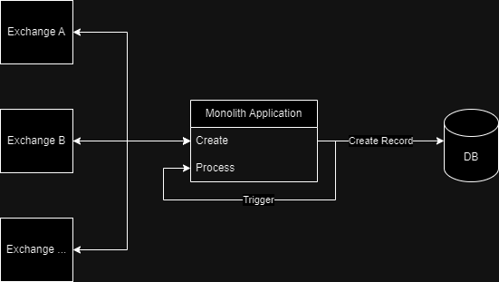
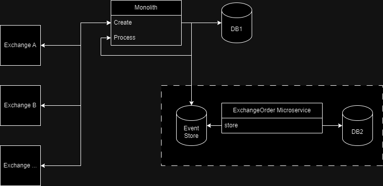
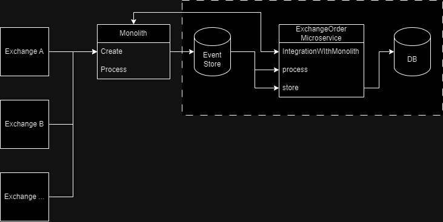
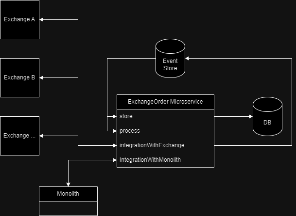

# CoinGate Architecture Assignment
Design document describing possible transition from monolithic application that

## Current Design
High level architecture diagram for current architecture. From provided description currently system integrates with multiple
exchanges. This integration triggers creation of a database record and such entry processing in the background within
application.

## Transition
High Level architecture diagrams showing transition from monolith to microservice architecture. Transition is suggested
to be carried in multiples steps to ensure existing system remains functional and testing could be carried in stages.

### Step 1
Introduce ExchangeOrder microservice that will be responsible for handling ExchangeOrders. Create additional database (db2)
from existing database (db1). Create event store which will be used by microservice to produce event messages and will be
consumed by ExchangeOrder microservice. Retain existing implementation for monolith in place, introduce logic needed in
monolith to send event messages when new ExchangeOrder needs to be created. Test that messages successfully arrive to
event store, successfully being consumed by ExchangeOrder microservice and stored to db2. Test db2 and db1 data consistency.

### Step 2
Implement exchange order processing logic in microservice and provide integration for monolith (for cases when monolith
depends on exchange order data, etc.). Deprecate/remove processing logic from monolith. Update monolith logic for handling
exchange orders, by removing persistence logic for exchange order.

### Final Step
Implement integration with exchanges to handle exchange orders. Deprecate/remove monolith integrations that handles exchange
orders.

## Microservice Design

### Responsibilities
ExchangeOrder microservice should be responsible solely for dealing with exchange orders, provide integration to internal
services (monolith) and implement integration with exchanges that relate to exchange orders.

### Interaction with Monolith
Monolith will interact with microservice via event store. This should cover described storage and order processing functionality.
For event store I would suggest using kafka as it will provide scalability, high availability, high throughput and permanent store.
Other functionality that should be present between microservice and monolith wasn't mentioned, but I assume monolith 
might need to retrieve exchange order data from microservice. Functionality in diagram listed as integrationWithMonolith
should either be implemented via http. We could either use REST or gRPC. Both should suffice here, gRPC should provide
better performance and should handle better data heavy microservices. REST should be easier implement and is loosely
coupled (client and the server doesn't need to know other's implementation).

### Database Design
It is possible to stick to existing database design if we aren't facing scalability issues. If we need to improve scalability
we could switch from relational to nosql database.

## Data Consistency and transactions
To handle events that fail to be processed we can introduce error and/or retry topics. These should allow to mark events
that failed (events that cannot be processed) or needs to be retried(need to wait for some resource that is not currently available).

## Monitoring and logging
For monitoring, logging and tracing we can use OpenTelemetry, as it produces vendor neutral standard format and can be
forwarded to compliant systems. We can then integrate OpenTelemetry with variety of other tools like Grafana, Prometheus,
Datadog, ElasticSearch, New Relic, etc.

## Security
Communication between microservices and monolith should happen using tls. Use private network where possible to
hide services that shouldn't be accessible by outside services. Use authentication to know exactly who is accessing the
service. Authorization should be used to give services permission to access certain resources. Use static analysis
security testing(SAST) and dynamic analysis security testing(DAST). Dependency scanning to ensure third-party libraries
are up-to-date. Introduce rate limiting when possible.

For authentication, we should use centralized identity provider tokens to authenticated services. JSON web tokens can be
used as token standard. Such tokens could either be validated by identity provider or contain public keys used by identity
provider to validate tokens within any microservice, therefore removing network calls to validate token.

Authorization could be implemented either as role-based access control (role could identify the caller) or attribute-based 
access control (identifies resource, action and context). Roles or attributes can be encoded in the tokens issued by centralized
identity provider.

